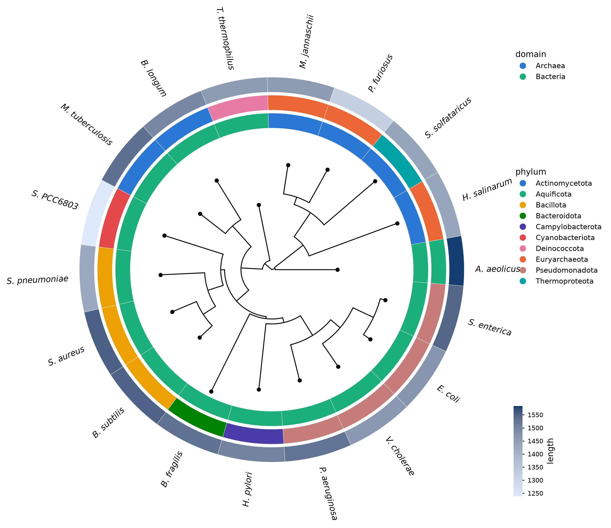
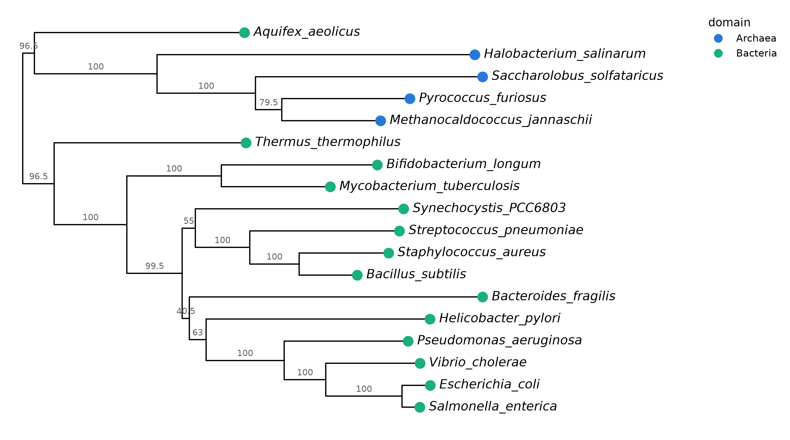
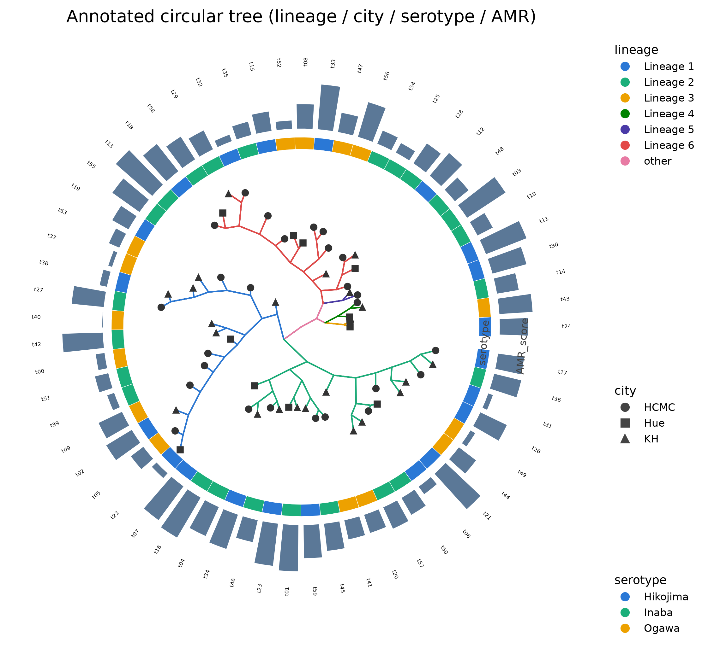
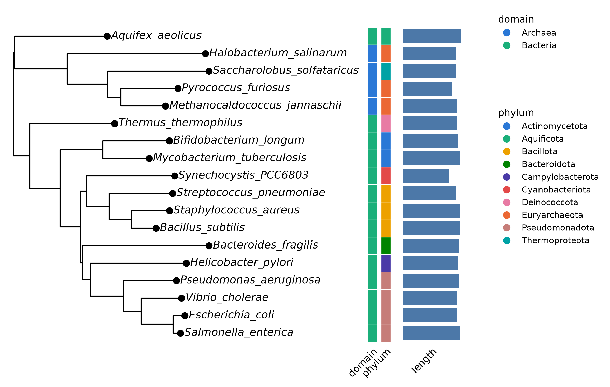
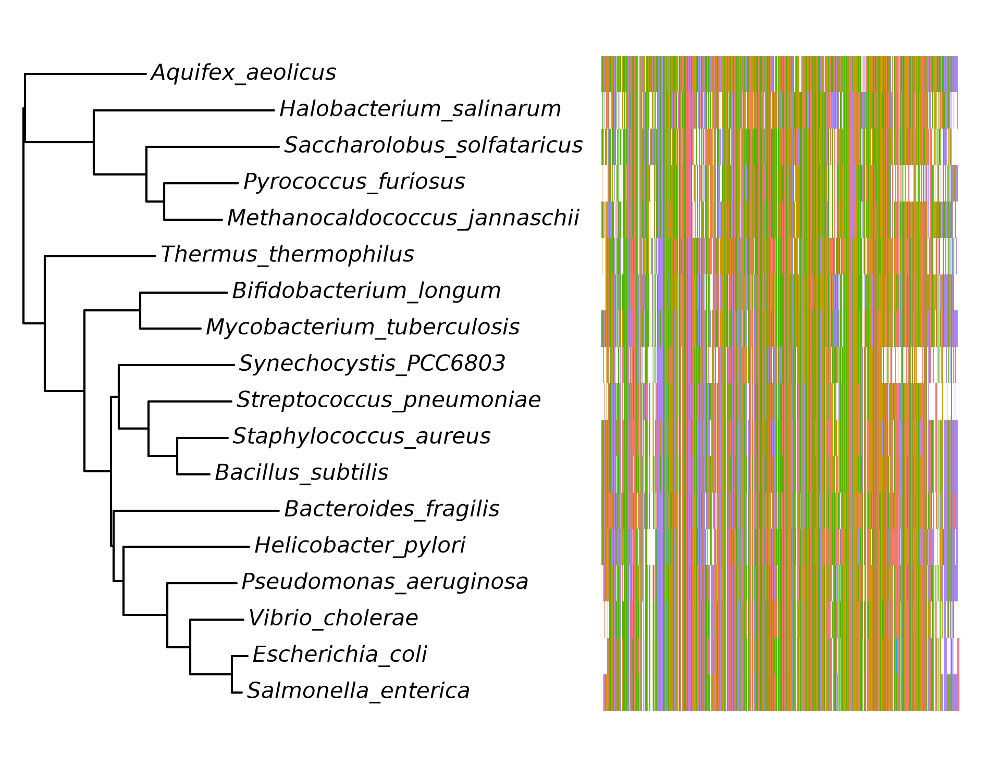

<p align="center">
  
</p>

<p align="center">
  <b>Phylogenetic trees and publication-quality figures in Python.</b>
</p>

<p align="center">
  phytreon combines tree inference, metadata-aware visualization, and
  static/interactive figure export in a fluent, pure-Python workflow.
</p>

<p align="center">
  <a href="LICENSE"></a>
  
  <a href="https://github.com/DeweyYihengDu/phytreon/actions/workflows/ci.yml"></a>
  <a href="https://pypi.org/project/phytreon/"></a>
  <a href="https://deweyyihengdu.github.io/phytreon/"></a>
  
  
  
</p>

### Why phytreon?

<table>
  <tr>
    <td width="33%"><b>🌿 Fluent <code>TreeFigure</code> builder</b><br><sub>Compose a figure by chaining visual layers onto a tree.</sub></td>
    <td width="33%"><b>🎨 Static + interactive backends</b><br><sub>matplotlib for PDF/SVG/PNG, plotly for interactive HTML.</sub></td>
    <td width="33%"><b>🧬 Sequence-to-tree pipeline</b><br><sub>One call: align → trim → infer → bootstrap.</sub></td>
  </tr>
  <tr>
    <td><b>🧫 Metadata rings / heatmaps / tracks</b><br><sub>Annotate tips with rings, heatmaps, bars, alignments.</sub></td>
    <td><b>🌳 ML / parsimony / NJ inference</b><br><sub>Pure-Python likelihood, parsimony, and distance trees.</sub></td>
    <td><b>📄 Publication-ready exports</b><br><sub>Vector PDF/SVG, raster PNG, or interactive HTML.</sub></td>
  </tr>
</table>

<p align="center">
  
</p>

<p align="center">
  <i>A circular 16S rRNA tree of common microbes (real NCBI data bundled in <code>examples/</code>),
  with domain / phylum / length rings — built and drawn entirely in phytreon.</i>
</p>

---

## Quickstart

```bash
pip install phytreon                  # from PyPI
pip install phytreon[interactive]     # + plotly (interactive HTML backend)
```

Developing locally (from a clone of this repo):

```bash
pip install -e .                 # core (numpy, scipy, pandas, matplotlib, biopython)
pip install -e .[interactive]    # + plotly (interactive HTML backend)
pip install -e .[dev]            # + pytest, plotly
```

```python
import phytreon as pt

tr = pt.datasets.primates()                      # a small illustrative toy tree
meta = pt.datasets.primates_metadata().reset_index()
tr.join_data(meta, on="name")                    # attach metadata to tips

(pt.TreeFigure(tr)                               # skeleton drawn for you
    .tip_points(color="habitat", size=9)         # color mapped from metadata
    .tip_labels()
    .support_labels()                            # node support values
).save("tree.pdf")                               # PDF/SVG/PNG -> matplotlib
 # .save("tree.html")                            # HTML        -> plotly (zoom/hover)
```

The output backend is chosen from the file extension: `.pdf` / `.svg` / `.png`
render through matplotlib, `.html` renders an interactive plotly figure.

---

## Gallery

Every figure below is produced by a script in [`examples/`](examples/)
(regenerate with `python examples/<name>.py`).

<table>
  <tr>
    <td width="50%">
      <br>
      <b>Rectangular</b><br>
      <sub>16S tree of life, tips colored by domain, bootstrap support (200 reps) — <code>tree_of_life_demo.py</code></sub>
    </td>
    <td width="50%">
      <br>
      <b>Annotated circular</b><br>
      <sub>Lineage-colored branches, shaped tips, tile + bar rings, three legends — <code>showcase_circular.py</code></sub>
    </td>
  </tr>
  <tr>
    <td width="50%">
      <br>
      <b>Aligned tracks</b><br>
      <sub>Stacked categorical tile tracks plus a numeric bar track — <code>tracks_demo.py</code></sub>
    </td>
    <td width="50%">
      <br>
      <b>Alignment track</b><br>
      <sub>The multiple-sequence alignment as a residue raster — <code>tracks_demo.py</code></sub>
    </td>
  </tr>
</table>

---

## From sequences to a tree

<p align="center">
  
</p>

One configurable call runs **align → trim → infer → bootstrap**, each stage
opt-in and fully parameterized:

```python
tree = pt.build_tree(
    "seqs.fasta",                       # path, list of (name, seq), or Alignment
    aligner="builtin",                  # pure-Python MSA  (or "mafft"/"muscle"/"none")
    align_kw=dict(match=2, gap=-3),
    trim_kw=dict(max_gap=0.4, min_occupancy=0.5, min_conservation=0.3),
    method="nj",                        # "nj" | "upgma" | "ml" | "parsimony"
    root="midpoint",
    bootstrap=200,                      # bipartition support
)
# distances are JC69-corrected by default (dist_model="jc69"|"k2p"|"raw");
# negative NJ branch lengths are clamped to 0.

# maximum likelihood (pure Python), HKY85 + Γ4 rate variation + NNI:
ml = pt.build_tree("seqs.fasta", method="ml", ml_model="HKY85", ml_gamma=4,
                   bootstrap=100)               # bootstrap works for nj/ml/parsimony
print(ml.data["logL"], ml.data["AIC"], ml.data["gamma_shape"])
pt.model_finder("seqs.fasta")                   # rank JC/K80/HKY/GTR ±G by AIC
# large datasets -> external engines: build_tree(..., method="ml", ml_engine="iqtree")
```

Each step is also usable on its own: `pt.align`, `pt.trim`,
`pt.neighbor_joining`, `pt.bootstrap_support`, `pt.infer_ml`,
`pt.parsimony_tree`.

### From a distance or character matrix

A precomputed distance matrix (samples × samples) skips alignment entirely:

```python
import pandas as pd

df = pd.read_csv("distances.csv", index_col=0)     # square matrix, taxa on both axes
tree = pt.neighbor_joining(list(df.index), df.values.tolist())   # or pt.upgma(...)
```

A discrete character/trait matrix (samples × characters -- e.g. a 0/1 gene
presence/absence table) goes through `read_character_matrix` and straight
into parsimony:

```python
aln = pt.read_character_matrix("genes.csv", taxa_col="name")   # or a DataFrame
tree = pt.parsimony_tree(aln, search=True)
(pt.TreeFigure(tree.ladderize()).tip_labels().support_labels()).save("tree.pdf")
```

Any small set of hashable states per column works (numbers, strings,
booleans); missing values (`NaN`, or an explicit `missing=` sentinel) are
encoded as ambiguous so they never force a false character change.

---

## What phytreon includes

| Area | Capabilities |
|---|---|
| **I/O & data model** | Newick / Nexus / PhyloXML read-write; metadata joins (`Tree.join_data`) |
| **Layouts** | rectangular, slanted, dendrogram, circular, fan, radial, inward-circular, unrooted (equal-angle / equal-daylight) |
| **Inference** | NJ, UPGMA (model-corrected distances or a precomputed distance matrix), ML (JC69/K80/HKY85/GTR, +Γ, NNI, AIC/BIC), parsimony (from sequences or a discrete character/trait matrix via `read_character_matrix`), bootstrap, built-in MSA, trimming |
| **Comparative** | ancestral states (parsimony / Mk-ML ER·SYM·ARD / Brownian), stochastic mapping, painted branches, node pies |
| **Figure tracks** | tip / node / support labels, tip points, metadata rings, heatmaps, bar tracks, alignment rasters |
| **Tree operations** | rotate, flip, ladderize, collapse, scale clade, midpoint root, cut tree, Robinson-Foulds |

---

## The `TreeFigure` builder

`TreeFigure` starts from a tree skeleton and lets you compose visual layers
fluently — every method returns the figure, so calls chain.

| Method | Draws |
|---|---|
| `.branches(color=, size=)` | the tree skeleton (e.g. color by lineage) |
| `.tip_labels()` / `.node_labels()` / `.support_labels()` | text labels |
| `.tip_points()` / `.node_points()` / `.points()` | markers (color / size / shape mapping) |
| `.highlight(node=)` / `.clade_label(...)` | shade / bracket a clade |
| `.heatmap(df)` | a matrix of cells aligned to the tips (rectangular) |
| `.ring(df, columns=…)` | concentric metadata rings (circular), tile or bar |
| `.bar_track(df, col)` | a horizontal bar track |
| `.alignment(aln)` | a residue-colored MSA raster |
| `.painted_branches()` | branches painted by stochastic-map state |
| `.node_pies()` | ancestral-state pies at internal nodes |
| `.time_axis(geo=True)` | a time / geological-period axis |

Continuous columns get a colorbar, categorical ones a legend; tracks, labels,
and legends are placed so nothing overlaps. Layouts: `rectangular`, `slanted`,
`dendrogram`, `circular`, `fan`, `radial`, `inward_circular`,
`unrooted` / `daylight` (equal-daylight), `equal_angle`.

---

## Architecture

The single design decision that makes the dual backend work: **layout and
rendering are completely decoupled.** A layout computes *final cartesian
coordinates* and emits backend-agnostic primitives; matplotlib and plotly are
"dumb" renderers that only translate those primitives. Adding a backend means
writing one translator — nothing in the phylogenetic logic changes.

| Module | Responsibility |
|---|---|
| `core` | `Tree` / `Node` data model + I/O |
| `layout` | topology → display coordinates |
| `scene` | `Path` / `Marker` / `Label` / `Polygon` primitives |
| `plot` | `TreeFigure` builder + matplotlib / plotly backends |
| `infer` | alignment / trimming / NJ / ML / parsimony / bootstrap |
| `comparative` | ancestral states + stochastic mapping |

---

## Comparison to other Python tools

| | phytreon | ete3 | toytree | Bio.Phylo | dendropy |
|---|:---:|:---:|:---:|:---:|:---:|
| Fluent figure builder | ✅ | ✗ | partial | ✗ | ✗ |
| Static **and** interactive backend | ✅ mpl + plotly | own GUI / SVG | toyplot | basic mpl | ✗ |
| Annotation tracks (heatmap / rings / MSA / bars) | ✅ | partial | partial | ✗ | ✗ |
| Built-in ML (+Γ) / parsimony | ✅ pure-Python | ✗ | ✗ | ✗ | ✗ |
| Comparative (ancestral states / stochastic map) | ✅ | ✗ | ✗ | ✗ | partial |
| Pure Python, pip-installable | ✅ | ✅ (Qt for GUI) | ✅ | ✅ | ✅ |

phytreon's niche is a fluent figure builder plus a self-contained phylogenetics
stack, with optional external tools for large-scale alignments or rigorous
large-scale ML (`aligner="mafft"`, `ml_engine="iqtree"`).

---

## Validation

`validation/validate.py` checks the core algorithms in **pure Python** (no
external tools):

- the likelihood engine (pattern-compressed, rescaled) matches an independent
  naive re-implementation to **machine precision** (|Δ| ≈ 1e-13);
- **neighbor-joining recovers a tree exactly from its own additive (patristic)
  distances** (Robinson-Foulds = 0, via `pt.robinson_foulds`) — the defining
  guarantee of NJ;
- ML recovers a known clade and reports a finite logL / AIC.

---

## More

<details>
<summary><b>Reshaping trees (move branches freely)</b></summary>

```python
pt.ladderize(tree)                      # tidy ordering
pt.rotate(tree, node)                   # flip a clade's vertical order
pt.flip(tree, node_a, node_b)           # swap two clades' positions
pt.collapse_low_support(tree, 70)       # weak edges -> polytomies
pt.scale_clade(tree, node, 0.5)         # de-emphasize a clade's branch lengths
pt.midpoint_root(tree)                  # root an unrooted (NJ) tree
clusters = pt.cut_tree(tree, k=4)       # {tip_name: cluster_id}
```

Because layout derives tip rows from child order, `rotate` / `flip` are exactly
how you nudge branches up and down on the plot.
</details>

<details>
<summary><b>Comparative & time-scaled trees</b></summary>

```python
pt.stochastic_map(tree, trait, n=200)        # stochastic character mapping
(pt.TreeFigure(tree).painted_branches()      # branches painted by inferred state
    .tip_labels())

(pt.TreeFigure(dated_tree)                    # branch lengths = time
    .time_axis(geo=True, gridlines=True, unit="Mya")  # geological bands
    .tip_labels())
```
</details>

<details>
<summary><b>Circular tree with metadata rings</b></summary>

```python
(pt.TreeFigure(tree, layout="circular", extent=320)
    .ring(meta_df,                             # DataFrame indexed by tip name
          columns=["habitat", "diet", "body_mass_kg"],
          width=0.13, gap=0.03)                # each column -> one ring
    .tip_labels()
).save("rings.png")
```

Rings stack outward (categorical → palette, numeric → gradient, each with its
own legend); tip labels are pushed outside all rings automatically, so the
tree, rings, labels, and legends never overlap.
</details>

<details>
<summary><b>Colors</b></summary>

Categorical aesthetics use an HCL **hue-wheel** palette by default (for 3
levels: a balanced `#F8766D #00BA38 #619CFF`); continuous aesthetics use a
dark-blue → light-blue gradient. Override per element:

```python
fig.tip_points(color="habitat", palette="dark2")   # hue | set2 | dark2 | tab10
fig.heatmap(mat, cmap="viridis")                    # name, or ("#fff","#c00") gradient
```

See `phytreon/plot/palettes.py` (`hue_palette`, `lerp_color`).
</details>

<details>
<summary><b>Environment notes</b></summary>

- **Static figures** use matplotlib (`.save("x.pdf"/".png"/".svg")`) and are
  always reliable. **Interactive** output uses plotly (`.save("x.html")`).
- plotly's static PNG export (kaleido) is flaky on some Windows setups; pin
  `kaleido==0.2.1` for plotly 5, or just use matplotlib for static figures and
  HTML for interactivity.
- The plotly backend's legends are click-to-toggle traces and track placement
  is heuristic (it cannot measure text); the matplotlib backend is the reference
  for exact, publication-quality layout.
</details>

<details>
<summary><b>Caveats</b></summary>

- The **built-in aligner** is a single-pass progressive aligner (linear gaps);
  fine for small/medium inputs, but use MAFFT (`aligner="mafft"`) for
  publication alignments.
- **Native ML / parsimony assume binary trees**; NNI search skips polytomies
  (resolve them first if needed). Pure-Python ML / MSA target tens of taxa —
  see `benchmark/`.
</details>

<details>
<summary><b>Extending</b></summary>

- **New layout**: subclass `phytreon.layout.base.Layout`, implement `compute()`
  (write `node.x` / `node.y`), `branch_path()`, `child_connector()`, and
  register it in `phytreon/layout/__init__.py::LAYOUTS`. The builder and both
  backends pick it up automatically.
- **New element**: subclass `phytreon.plot.figure._Element`, implement
  `apply(ctx)` to read coordinates and append `scene` primitives (use
  `ctx.resolve_color(...)` for metadata-driven aesthetics + legends), then add
  it with `TreeFigure.add(...)`.
</details>

<details>
<summary><b>Example data (real, from NCBI)</b></summary>

`examples/data/` ships a small **microbial "tree of life" 16S rRNA** set
downloaded from NCBI — common model organisms and type strains across the
major bacterial phyla plus four archaea (a natural outgroup) — so the whole
pipeline runs on real, public sequences:

```
examples/data/tol_16S.fasta          18 unaligned 16S sequences (mostly RefSeq NR_*)
examples/data/tol_16S_aligned.fasta  built-in MSA of the above (cached)
examples/data/tol_metadata.csv       domain / phylum / organism / accession / length
examples/data/fetch_example_data.py  re-download script (Entrez)
```

An NJ/ML tree on this set recovers the four archaea as a monophyletic clade
(deep bacterial splits from a single 16S gene are, as expected, only weakly
supported). Accession versions may advance over time, so re-downloading need
not byte-match the shipped snapshot; the cached alignment keeps the examples
reproducible offline. Full accession list and license: `examples/data/SOURCES.md`.
</details>

---

## Examples & tests

```bash
python examples/demo.py               # rect / circular / heatmap / nj / ancestral
python examples/pipeline_demo.py      # raw sequences -> align -> trim -> NJ -> bootstrap
python examples/tree_of_life_demo.py  # real 16S -> tree + circular metadata rings
python examples/showcase_circular.py  # lineage colors + tile + bar rings + shapes
python examples/tracks_demo.py        # rectangular tile / bar tracks + alignment track
python examples/ml_demo.py            # native pure-Python ML tree (HKY85)
python validation/validate.py         # pure-Python correctness checks
python benchmark/benchmark.py         # timings + validated-core guidance
pytest -q                             # 37 tests

# docs: pip install mkdocs-material mkdocstrings[python]; mkdocs serve
```

---

<p align="center">
  <sub>MIT licensed · Built for reproducible phylogenetic visualization in Python.</sub>
</p>
