<p align="center">
  
</p>

<p align="center">
  <b>Phylogenetic trees and publication-quality figures in Python.</b>
</p>

<p align="center">
  phytreon combines tree inference, metadata-aware visualization, and
  static/interactive figure export in a fluent, pure-Python workflow.
</p>

<p align="center">
  <a href="LICENSE"></a>
  
  <a href="https://github.com/DeweyYihengDu/phytreon/actions/workflows/ci.yml"></a>
  <a href="https://pypi.org/project/phytreon/"></a>
  <a href="https://deweyyihengdu.github.io/phytreon/"></a>
  
  
  
</p>

### Why phytreon?

<table>
  <tr>
    <td width="33%"><b>🌿 Fluent <code>TreeFigure</code> builder</b><br><sub>Compose a figure by chaining visual layers onto a tree.</sub></td>
    <td width="33%"><b>🎨 Static + interactive backends</b><br><sub>matplotlib for PDF/SVG/PNG, plotly for interactive HTML.</sub></td>
    <td width="33%"><b>🧬 Sequence-to-tree pipeline</b><br><sub>One call: align → trim → infer → bootstrap.</sub></td>
  </tr>
  <tr>
    <td><b>🧫 Metadata rings / heatmaps / tracks</b><br><sub>Annotate tips with rings, heatmaps, bars, alignments.</sub></td>
    <td><b>🌳 ML / parsimony / NJ inference</b><br><sub>Pure-Python likelihood, parsimony, and distance trees.</sub></td>
    <td><b>📄 Publication-ready exports</b><br><sub>Vector PDF/SVG, raster PNG, or interactive HTML.</sub></td>
  </tr>
</table>

<p align="center">
  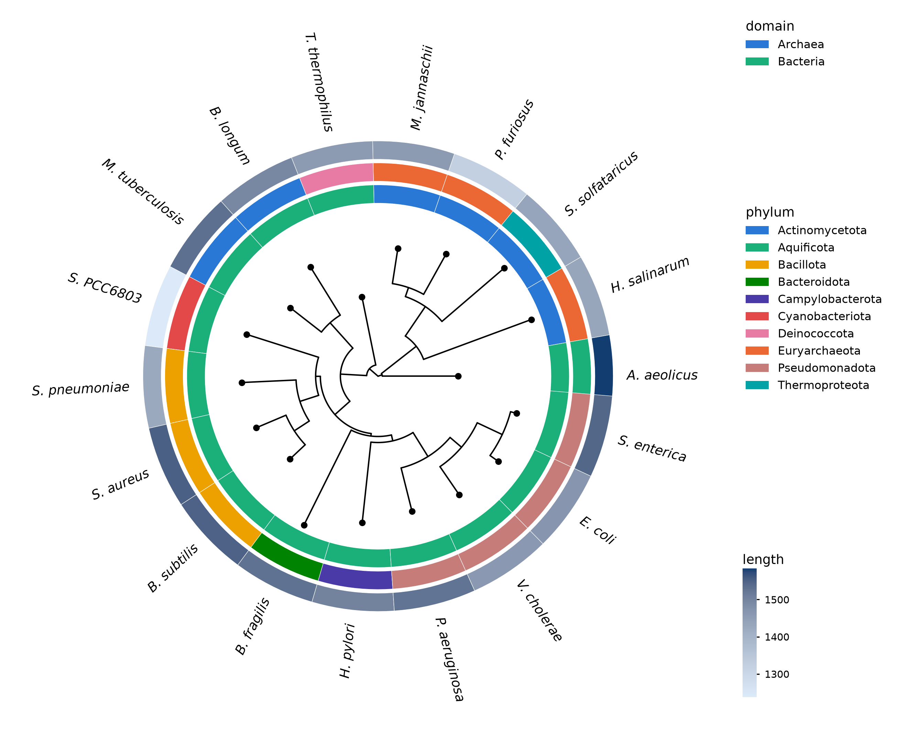
</p>

<p align="center">
  <i>A circular 16S rRNA tree of common microbes (real NCBI data bundled in <code>examples/</code>),
  with domain / phylum / length rings — built and drawn entirely in phytreon.</i>
</p>

---

## Quickstart

```bash
pip install phytreon                  # from PyPI
pip install phytreon[interactive]     # + plotly (interactive HTML backend)
```

Developing locally (from a clone of this repo):

```bash
pip install -e .                 # core (numpy, scipy, pandas, matplotlib, biopython)
pip install -e .[interactive]    # + plotly (interactive HTML backend)
pip install -e .[dev]            # + pytest, plotly
```

```python
import phytreon as pt

tr = pt.datasets.primates()                      # a small illustrative toy tree
meta = pt.datasets.primates_metadata().reset_index()
tr.join_data(meta, on="name")                    # attach metadata to tips

(pt.TreeFigure(tr)                               # skeleton drawn for you
    .tip_points(color="habitat", size=9)         # color mapped from metadata
    .tip_labels()
    .support_labels()                            # node support values
).save("tree.pdf")                               # PDF/SVG/PNG -> matplotlib
 # .save("tree.svg")                             # SVG: editable text -> drop into PowerPoint
 # .save("tree.html")                            # HTML        -> plotly (zoom/hover)
```

The output backend is chosen from the file extension: `.pdf` / `.svg` / `.png`
render through matplotlib, `.html` renders an interactive plotly figure.

---

## Gallery

Every figure below is produced by a script in [`examples/`](examples/)
(regenerate with `python examples/<name>.py`).

<table>
  <tr>
    <td width="50%">
      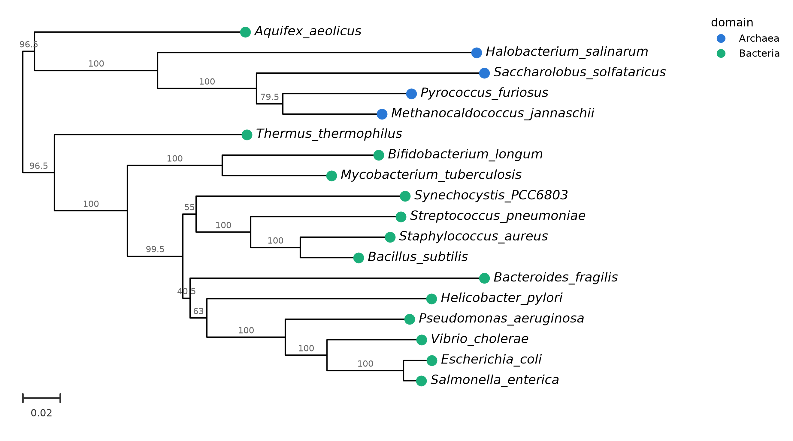<br>
      <b>Rectangular</b><br>
      <sub>16S tree of life, tips colored by domain, bootstrap support (200 reps) — <code>tree_of_life_demo.py</code></sub>
    </td>
    <td width="50%">
      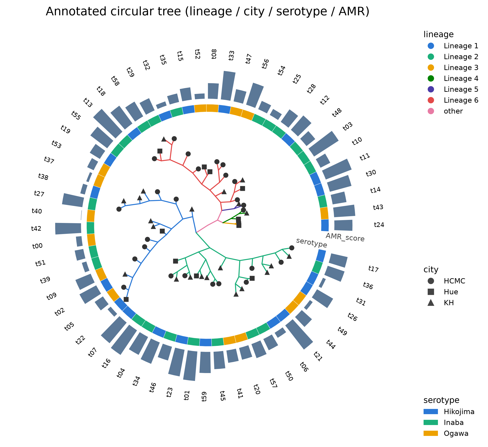<br>
      <b>Annotated circular</b><br>
      <sub>Slanted (starburst) branches coloured by lineage, shaped tips, tile + bar rings, three legends — <code>showcase_circular.py</code></sub>
    </td>
  </tr>
  <tr>
    <td width="50%">
      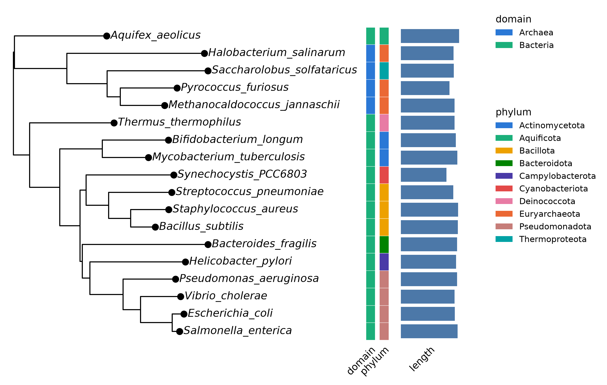<br>
      <b>Aligned tracks</b><br>
      <sub>Stacked categorical tile tracks plus a numeric bar track — <code>tracks_demo.py</code></sub>
    </td>
    <td width="50%">
      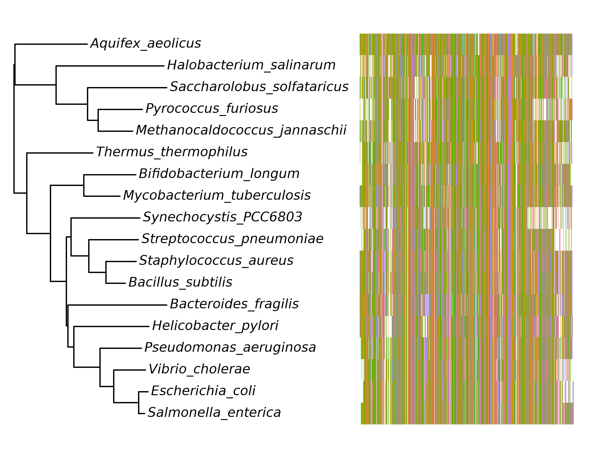<br>
      <b>Alignment track</b><br>
      <sub>The multiple-sequence alignment as a residue raster — <code>tracks_demo.py</code></sub>
    </td>
  </tr>
  <tr>
    <td width="50%">
      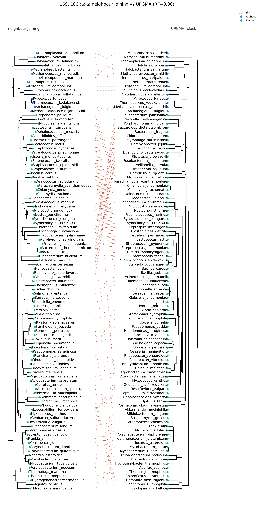<br>
      <b>Tanglegram</b><br>
      <sub>106 taxa, 25 phyla: neighbour joining vs UPGMA, untangled, with the links that still cross highlighted — <code>tanglegram_demo.py</code></sub>
    </td>
    <td width="50%">
      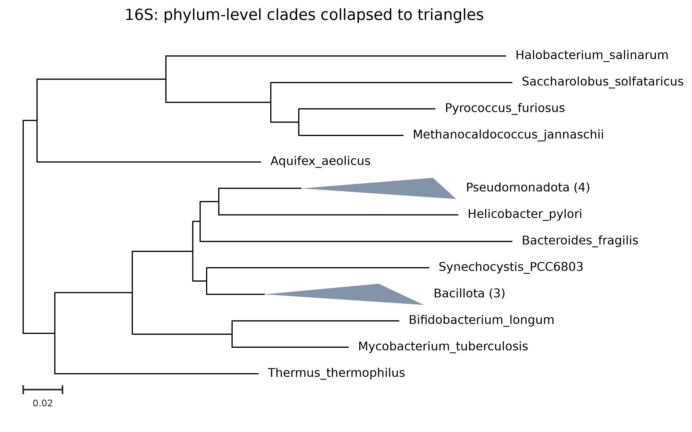<br>
      <b>Collapsed clades</b><br>
      <sub>Phylum-level clades collapsed to triangles reaching their nearest/farthest hidden leaf — <code>tree_styles_demo.py</code></sub>
    </td>
  </tr>
  <tr>
    <td width="50%">
      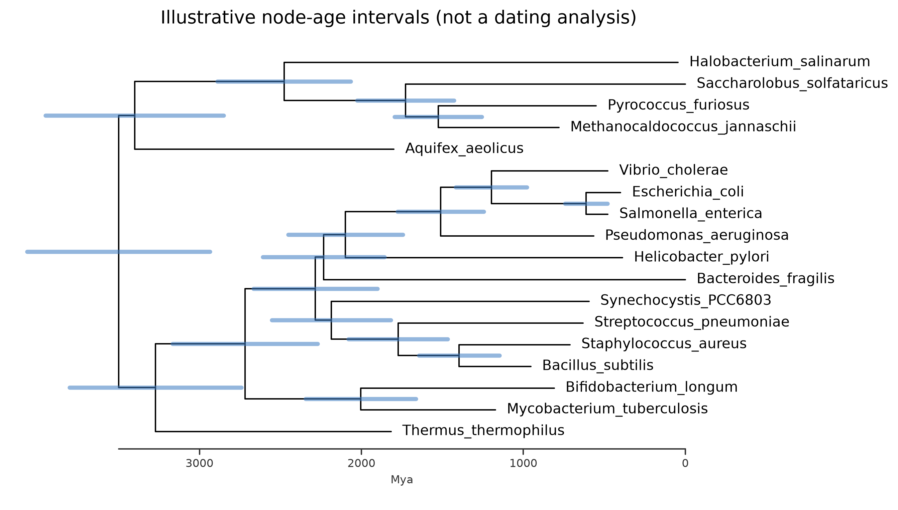<br>
      <b>Node interval bars</b><br>
      <sub>95% HPD node-age intervals against a time axis, as read from a BEAST/MrBayes summary tree — <code>tree_styles_demo.py</code></sub>
    </td>
    <td width="50%">
      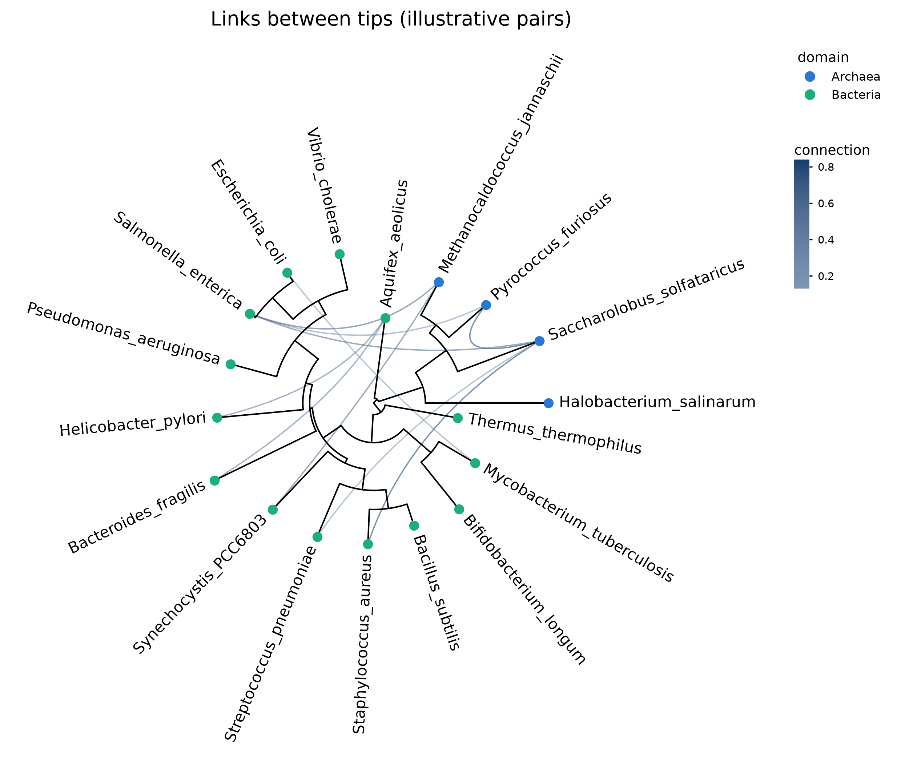<br>
      <b>Connections</b><br>
      <sub>Curved links between tips for HGT, gene sharing, or co-occurrence, coloured by strength — <code>tree_styles_demo.py</code></sub>
    </td>
  </tr>
  <tr>
    <td width="50%">
      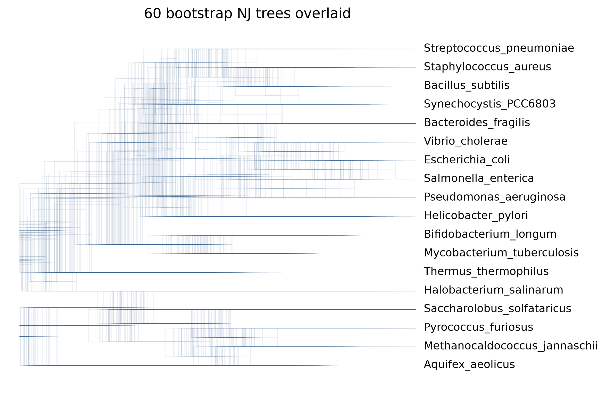<br>
      <b>DensiTree</b><br>
      <sub>60 bootstrap NJ trees overlaid — dark where they agree, fanned out where they don't — <code>tree_styles_demo.py</code></sub>
    </td>
    <td width="50%">
      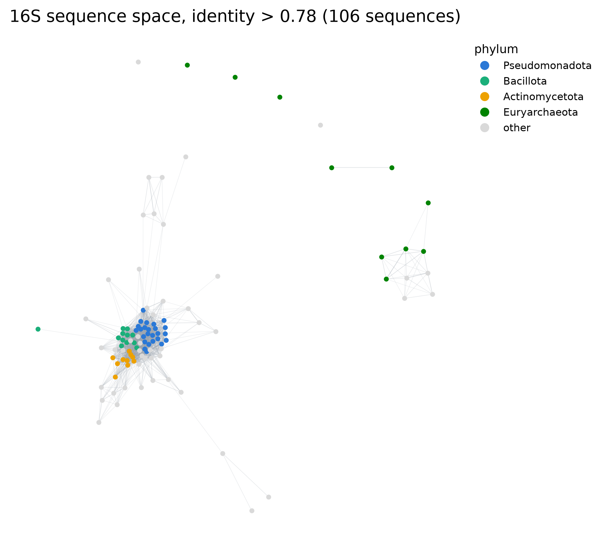<br>
      <b>Sequence network</b><br>
      <sub>CLANS-style cluster map — for families too divergent for a trustworthy tree — <code>network_demo.py</code></sub>
    </td>
  </tr>
  <tr>
    <td width="50%">
      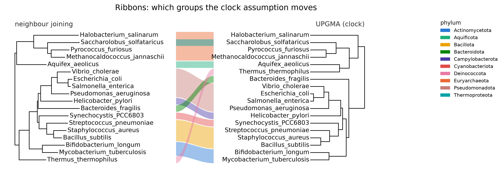<br>
      <b>Ribbon tanglegram</b><br>
      <sub>Bands instead of per-tip links — a flat band is a group both trees agree on, a twisted one is a group they move — <code>figstyles_demo.py</code></sub>
    </td>
    <td width="50%">
      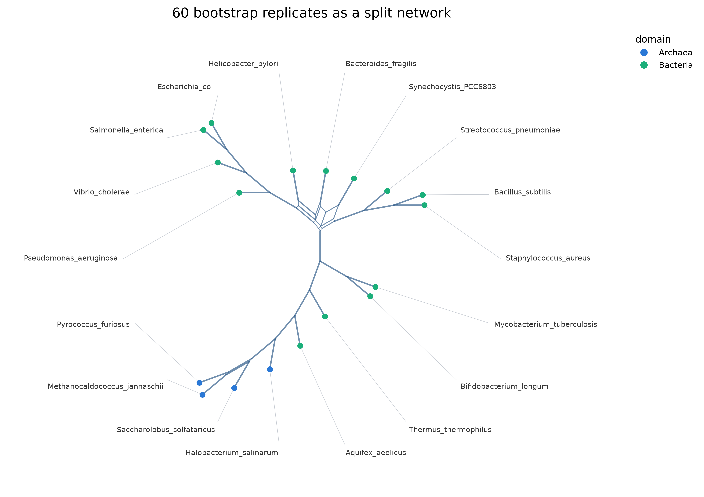<br>
      <b>Split network</b><br>
      <sub>Conflicting splits drawn as boxes instead of being resolved away; planar, via the circular ordering — <code>figstyles_demo.py</code></sub>
    </td>
  </tr>
  <tr>
    <td width="50%">
      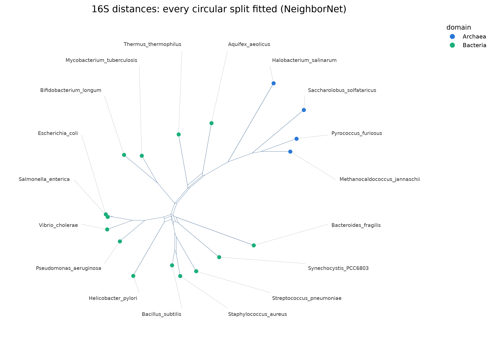<br>
      <b>Neighbor-Net</b><br>
      <sub>Straight from a distance matrix: agglomerative circular ordering plus a non-negative fit of every circular split — <code>figstyles_demo.py</code></sub>
    </td>
    <td width="50%">
      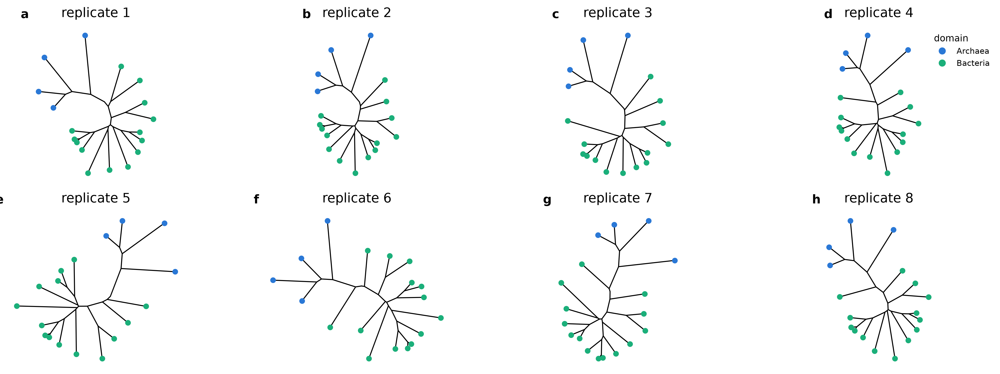<br>
      <b>Multi-panel grid</b><br>
      <sub>Many small figures under one shared key, for comparing families at a glance — <code>figstyles_demo.py</code></sub>
    </td>
  </tr>
  <tr>
    <td width="50%">
      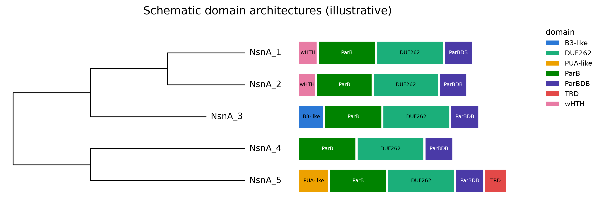<br>
      <b>Domain / gene track</b><br>
      <sub>Architecture beside each tip; arrows show strand, so a gained or swapped domain reads off the clade — <code>figstyles_demo.py</code></sub>
    </td>
    <td width="50%">
      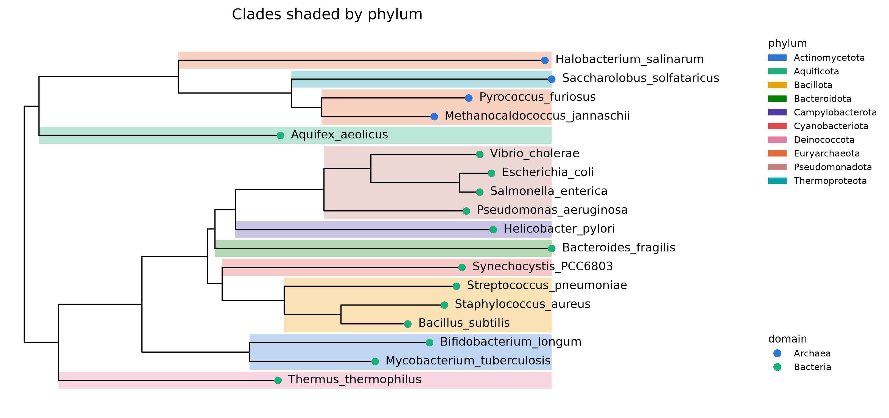<br>
      <b>Shaded clades</b><br>
      <sub>One call shades every group in a column behind the branches, with a key; a non-monophyletic group comes out as several bands — <code>tree_styles_demo.py</code></sub>
    </td>
  </tr>
  <tr>
    <td width="50%">
      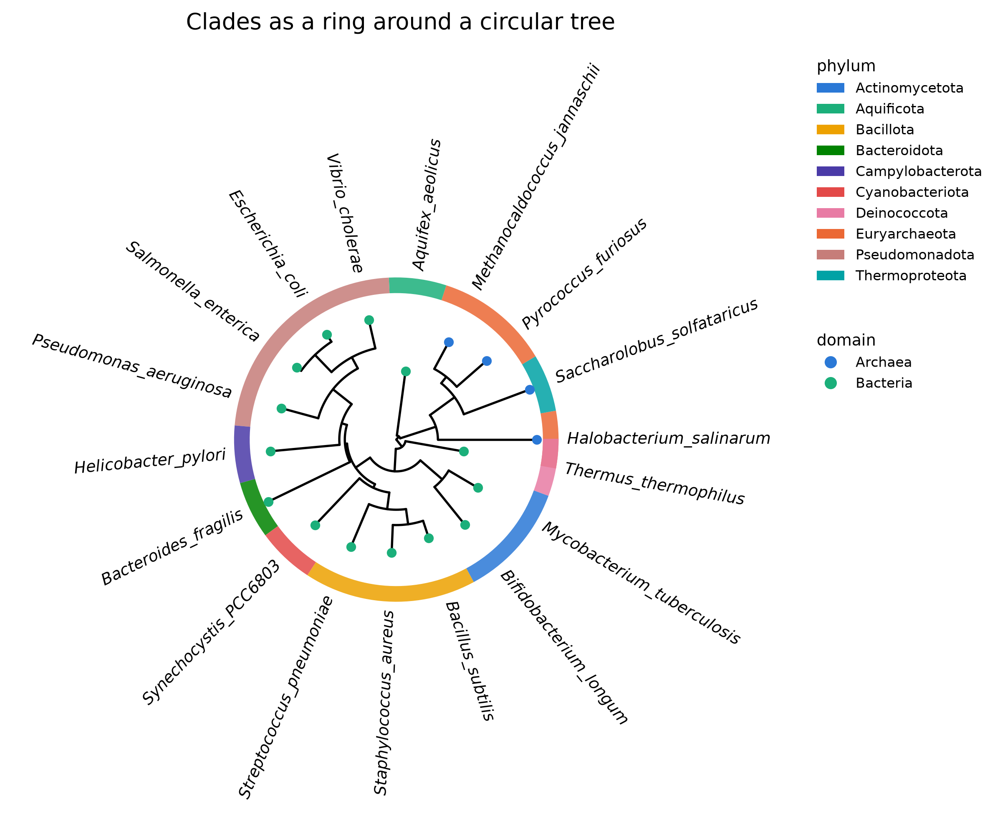<br>
      <b>Groups as a ring</b><br>
      <sub>The same grouping on a circular tree: a ring outside it, not sectors filled from the middle, so the tree stays readable — <code>tree_styles_demo.py</code></sub>
    </td>
    <td width="50%">
      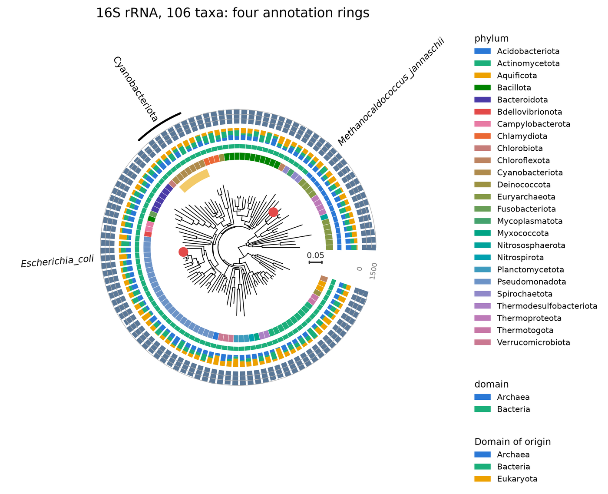<br>
      <b>Layered circular tree</b><br>
      <sub>What a large family looks like in print: no tip labels except the references, a tile ring, a composition ring, a bar ring, one clade bracketed — <code>dense_circular_demo.py</code></sub>
    </td>
  </tr>
</table>

---

## From sequences to a tree

<p align="center">
  
</p>

One configurable call runs **align → trim → infer → bootstrap**, each stage
opt-in and fully parameterized:

```python
tree = pt.build_tree(
    "seqs.fasta",                       # path, list of (name, seq), or Alignment
    aligner="builtin",                  # pure-Python MSA  (or "mafft"/"muscle"/"none")
    align_kw=dict(match=2, gap=-3),
    trim_kw=dict(max_gap=0.4, min_occupancy=0.5, min_conservation=0.3),
    method="nj",                        # "nj" | "upgma" | "ml" | "parsimony"
    root="midpoint",                    # or an outgroup: root="Escherichia_coli" / [...]
    bootstrap=200,                      # bipartition support
)
# distances are JC69-corrected by default (dist_model="jc69"|"k2p"|"poisson"|"raw");
# negative NJ branch lengths are clamped to 0.

# force a taxonomy column (e.g. genus) to come out monophyletic: constrained
# NJ (structural -- the tree cannot disagree) or a constrained ML search
# (the data can still win the ties an unlisted split leaves open)
genus_tree = pt.build_tree("asvs.fasta", method="nj",
                           constraint={"asv1": "Bacillus", "asv2": "Bacillus"})  # one per ASV
# pt.sort_by(tree, "genus") does the display-only version of the same idea on
# a tree that already exists: reorders branches, never moves one, so it can
# bring two clades already siblings closer together but not join ones the
# tree itself keeps apart -- what a genus the gene does not resolve gets is
# still as few separate runs as the topology allows, not one.

# maximum likelihood (pure Python), HKY85 + Γ4 rate variation + NNI:
ml = pt.build_tree("seqs.fasta", method="ml", ml_model="HKY85", ml_gamma=4,
                   bootstrap=100)               # bootstrap works for nj/ml/parsimony
print(ml.data["logL"], ml.data["AIC"], ml.data["gamma_shape"])
pt.model_finder("seqs.fasta")                   # rank JC/K80/HKY/GTR (or JTT/WAG/LG) ±G by AIC
# large datasets -> external engines:
#   build_tree(..., method="ml", ml_engine="iqtree")     # or "raxml-ng"/"fasttree"
#   build_tree(..., method="nj", nj_engine="rapidnj")    # builtin NJ is O(n^3)

# protein sequences work the same way -- pass amino acid sequences and an
# explicit protein model (ml_model's default stays "HKY85"; there is no
# "auto" alphabet detection, so a nucleotide/protein mismatch raises
# instead of silently miscoding the data):
prot = pt.build_tree("proteins.fasta", method="ml", ml_model="LG", bootstrap=100)
# dist_model's default stays "jc69", which falls back to raw p-distance on
# protein data unless you opt in to the protein-specific correction:
prot_nj = pt.build_tree("proteins.fasta", method="nj", dist_model="poisson")
```

Each step is also usable on its own: `pt.align`, `pt.trim`,
`pt.neighbor_joining`, `pt.bootstrap_support`, `pt.infer_ml`,
`pt.parsimony_tree`.

### From a distance or character matrix

A precomputed distance matrix (samples × samples) skips alignment entirely:

```python
import pandas as pd

df = pd.read_csv("distances.csv", index_col=0)     # square matrix, taxa on both axes
tree = pt.neighbor_joining(list(df.index), df.values.tolist())   # or pt.upgma(...)
```

A discrete character/trait matrix (samples × characters -- e.g. a 0/1 gene
presence/absence table) goes through `read_character_matrix` and straight
into parsimony:

```python
aln = pt.read_character_matrix("genes.csv", taxa_col="name")   # or a DataFrame
tree = pt.parsimony_tree(aln, search=True)
(pt.TreeFigure(tree.ladderize()).tip_labels().support_labels()).save("tree.pdf")
```

Any small set of hashable states per column works (numbers, strings,
booleans); missing values (`NaN`, or an explicit `missing=` sentinel) are
encoded as ambiguous so they never force a false character change.

Single-cell CRISPR lineage-tracing data (a Cassiopeia-style allele table) --
or any somatic-mutation genotype matrix, via `read_mutation_matrix` -- works
the same way, but with an irreversible ("Camin-Sokal") parsimony model
appropriate for scars/mutations that can never revert:

```python
aln = pt.read_allele_table("alleletable.txt")      # cellBC/intBC/r1/r2/r3
tree = pt.lineage_tree(aln, search=True)            # or build_tree(..., parsimony_model="camin_sokal")
print(tree.data["camin_sokal_score"], tree.data["excess_origins"])
```

Gene *expression* data is a different question -- similarity reflects cell
state, not ancestry, so it gets a distinctly-named, non-phylogenetic
dendrogram instead of a tree:

```python
import pandas as pd

expr = pd.read_csv("expression.csv", index_col=0)   # cells x genes
tree = pt.expression_dendrogram(expr, genes=["CD3D"])   # NOT a phylogeny
```

---

## What phytreon includes

| Area | Capabilities |
|---|---|
| **I/O & data model** | Newick / Nexus / PhyloXML read-write; annotated NEXUS from BEAST / MrBayes (`fmt="beast"`) keeping node ages, HPD intervals and posteriors; metadata joins (`Tree.join_data`) |
| **Layouts** | rectangular, slanted, dendrogram, circular, fan, radial, circular-slanted (straight diagonal edges), inward-circular, unrooted (equal-angle / equal-daylight) |
| **Inference** | NJ, UPGMA (model-corrected distances or a precomputed distance matrix), ML for nucleotide (JC69/K80/HKY85/GTR) and protein (JTT/WAG/LG) data, +Γ, NNI, AIC/BIC, `model_finder`, parsimony (from sequences, a discrete character/trait matrix via `read_character_matrix`, or single-cell lineage-tracing data via `read_allele_table`/`read_mutation_matrix` + irreversible Camin-Sokal parsimony), expression-similarity dendrograms (`expression_dendrogram` -- explicitly not phylogenetic), bootstrap, built-in MSA, trimming |
| **Comparative** | ancestral states (parsimony / Mk-ML ER·SYM·ARD / Brownian), stochastic mapping, painted branches, node pies |
| **Figure tracks** | tip / node / support labels, tip points, metadata rings, heatmaps, bar tracks, alignment rasters |
| **Tree comparison** | tanglegrams (`TangleFigure`) with rotation-based `untangle`, crossing counts, Robinson-Foulds; DensiTree clouds (`DensiTreeFigure`) for a whole tree set |
| **Group a tree visually** | Shade every clade in a metadata column behind the branches (`highlight(by=...)`), collapse clades to triangles, clade brackets |
| **When a tree would mislead** | CLANS-style sequence-similarity networks (`SequenceNetwork`); split networks (`SplitNetwork`) drawing conflicting splits as boxes; Neighbor-Net (`neighbor_net`) straight from a distance matrix |
| **Multi-panel figures** | `panels()` — a grid of any figure types with one shared colour key |
| **Alongside the tree** | domain architectures / gene neighbourhoods (`.domains()`), ribbons between two trees (`.ribbons()`), several support values per branch |
| **Tree operations** | rotate, flip, ladderize, collapse, scale clade, midpoint root, cut tree, Robinson-Foulds |

---

## The `TreeFigure` builder

`TreeFigure` starts from a tree skeleton and lets you compose visual layers
fluently — every method returns the figure, so calls chain.

| Method | Draws |
|---|---|
| `.branches(color=, size=)` | the tree skeleton (`size=` sets line width globally; e.g. color by lineage) |
| `.tip_labels()` / `.node_labels()` / `.support_labels()` | text labels |
| `.tip_points()` / `.node_points()` / `.points()` | markers (color / size / shape mapping) |
| `.highlight(node=)` / `.clade_label(...)` | shade / bracket a clade |
| `.heatmap(df)` | a matrix of cells aligned to the tips (rectangular) |
| `.ring(df, columns=…)` | concentric metadata rings (circular), tile or bar |
| `.bar_track(df, col)` | a horizontal bar track |
| `.alignment(aln)` | a residue-colored MSA raster |
| `.painted_branches()` | branches painted by stochastic-map state |
| `.node_pies()` | ancestral-state pies at internal nodes |
| `.time_axis(geo=True)` / `.scale_bar()` | a time / geological-period axis, or a compact branch-length scale |
| `.collapsed_clades()` | collapsed clades as triangles (with `pt.collapse_clade`) |
| `.node_bars()` | node age intervals, e.g. 95% HPD on a dated tree |
| `.connections(pairs)` | curved links between tips (HGT, co-occurrence) |
| `.domains(arch)` | domain architecture / gene neighbourhood beside each tip |

Continuous columns get a colorbar, categorical ones a legend; tracks, labels,
and legends are placed so nothing overlaps. Layouts: `rectangular`, `slanted`,
`dendrogram`, `circular`, `fan`, `radial`, `circular_slanted`,
`inward_circular`, `unrooted` / `daylight` (equal-daylight), `equal_angle`.

---

## Comparing two trees

`TangleFigure` faces two trees at each other and links their shared tips, so
disagreements read as crossing links — the picture for "does the transcriptome
tree agree with the genome tree?".

```python
fig = pt.TangleFigure(genome_tree, transcriptome_tree,
                      titles=("genome", "transcriptome"))
fig.untangle()                            # rotate clades to line the tips up
fig.connect(highlight_discordant=True)    # red = this taxon disagrees
fig.left.tip_points(color="phylum")       # each side is a full TreeFigure
fig.save("tanglegram.pdf")
```

Rotating a node reorders its children, so untangling changes only how the
trees read, never what they say. Whatever still crosses afterwards is real
conflict. Note that zero crossings does **not** mean the trees are identical —
they may merely admit a common tip order — so read `pt.robinson_foulds()`
alongside `pt.crossing_number()`. See
[the tutorial](docs/tutorials/tanglegram.md) and
`examples/tanglegram_demo.py`.

---

## Architecture

The single design decision that makes the dual backend work: **layout and
rendering are completely decoupled.** A layout computes *final cartesian
coordinates* and emits backend-agnostic primitives; matplotlib and plotly are
"dumb" renderers that only translate those primitives. Adding a backend means
writing one translator — nothing in the phylogenetic logic changes.

| Module | Responsibility |
|---|---|
| `core` | `Tree` / `Node` data model + I/O |
| `layout` | topology → display coordinates |
| `scene` | `Path` / `Marker` / `Label` / `Polygon` primitives |
| `plot` | `TreeFigure` builder + matplotlib / plotly backends |
| `infer` | alignment / trimming / NJ / ML / parsimony / bootstrap + per-domain and marker-gene workflows |
| `comparative` | ancestral states/sequences + stochastic mapping + diversity/signal/PGLS + community phylogenetics + trait-evolution models (BM/OU/EB) + phylogenetic PCA |

---

## Comparison to other Python tools

| | phytreon | ete3 | toytree | Bio.Phylo | dendropy |
|---|:---:|:---:|:---:|:---:|:---:|
| Fluent figure builder | ✅ | ✗ | partial | ✗ | ✗ |
| Static **and** interactive backend | ✅ mpl + plotly | own GUI / SVG | toyplot | basic mpl | ✗ |
| Annotation tracks (heatmap / rings / MSA / bars) | ✅ | partial | partial | ✗ | ✗ |
| Built-in ML (+Γ) / parsimony | ✅ pure-Python | ✗ | ✗ | ✗ | ✗ |
| Comparative (ancestral states / PD / UniFrac / PGLS / NRI·NTI·betaNTI / BM·OU·EB model choice / phylo-PCA / Fritz-Purvis D) | ✅ | ✗ | ✗ | ✗ | partial |
| Pure Python, pip-installable | ✅ | ✅ (Qt for GUI) | ✅ | ✅ | ✅ |

phytreon's niche is a fluent figure builder plus a self-contained phylogenetics
stack. The built-in aligner, native ML engine, and Biopython-backed NJ are
designed for small to medium examples, teaching, prototyping, and
reproducible pure-Python workflows — not as a replacement for MAFFT/MUSCLE,
IQ-TREE/RAxML-NG/FastTree, or RapidNJ on large production alignments (a
sizeable 16S ASV table, say). Plug those in when you need them
(`aligner="mafft"`, `ml_engine="iqtree"`/`"raxml-ng"`/`"fasttree"`,
`nj_engine="rapidnj"`), then use phytreon for tree manipulation, metadata
integration, and visualization.

---

## Validation

`validation/validate.py` checks the core algorithms in **pure Python** (no
external tools):

- the likelihood engine (pattern-compressed, rescaled) matches an independent
  naive re-implementation to **machine precision** (|Δ| ≈ 1e-13);
- **neighbor-joining recovers a tree exactly from its own additive (patristic)
  distances** (Robinson-Foulds = 0, via `pt.robinson_foulds`) — the defining
  guarantee of NJ;
- ML recovers a known clade and reports a finite logL / AIC.

---

## More

<details>
<summary><b>Reshaping trees (move branches freely)</b></summary>

```python
pt.ladderize(tree)                      # tidy ordering
pt.rotate(tree, node)                   # flip a clade's vertical order
pt.flip(tree, node_a, node_b)           # swap two clades' positions
pt.collapse_low_support(tree, 70)       # weak edges -> polytomies
pt.scale_clade(tree, node, 0.5)         # de-emphasize a clade's branch lengths
pt.midpoint_root(tree)                  # root an unrooted (NJ) tree
clusters = pt.cut_tree(tree, k=4)       # {tip_name: cluster_id}
```

Because layout derives tip rows from child order, `rotate` / `flip` are exactly
how you nudge branches up and down on the plot.
</details>

<details>
<summary><b>Comparative & time-scaled trees</b></summary>

```python
pt.stochastic_map(tree, trait, n=200)        # stochastic character mapping
(pt.TreeFigure(tree).painted_branches()      # branches painted by inferred state
    .tip_labels())

(pt.TreeFigure(dated_tree)                    # branch lengths = time
    .time_axis(geo=True, gridlines=True, unit="Mya")  # geological bands
    .tip_labels())
```
</details>

<details>
<summary><b>Protein trees that answer a biological question</b></summary>

Two workflows for the cases where one tree from one alignment is the wrong
object. Both are built around the same idea: **the disagreement between two
trees is often the result, not the noise** — and the thing that matters is
telling apart *one lineage genuinely misplaced* from *a region with no signal at
all*, because those mean opposite things and produce similar overall conflict
scores.

```python
# --- multidomain proteins: domains have separate histories ---
# A protein whose N-terminal domain belongs to one family and whose C-terminal
# domain belongs to an unrelated superfamily has two ancestries. One tree
# averages them into nobody's history. Cyanobacterial OCP is the textbook case:
# an all-helical NTD (relatives: HCPs) fused to an NTF2-like CTD (relatives:
# CTDHs).
cols = pt.residue_to_column(aln, "OCP_Synechocystis",   # HMMER residue ranges,
                            {"NTD": (1, 165), "CTD": (190, 317)})  # 1-based
res = pt.domain_trees(aln, cols, method="ml", ml_engine="iqtree")
cmp = pt.compare_domain_trees(res["trees"])
cmp["rf"]                    # how much the domain trees disagree overall
cmp["explained_by_one"]      # ... and whether ONE lineage accounts for it
cmp["worst_taxon"]           # which one -- the recombination candidate

# --- many marker genes: species tree, then per-gene conflict ---
sp = pt.species_tree(markers, min_occupancy=0.7,        # markers = {name: Alignment}
                     method="ml", ml_engine="iqtree")
sp["occupancy"]              # read this BEFORE the tree
gt = pt.gene_trees(markers, method="ml", ml_engine="iqtree")
pt.gene_tree_conflict(gt["trees"], sp["tree"])   # ranked HGT candidates

# concatenation assumes every gene shares one true tree -- incomplete lineage
# sorting breaks that assumption outright, and can make concatenation converge
# on the WRONG tree no matter how much data you add (Degnan & Rosenberg 2006's
# "anomaly zone"). astrid_tree instead averages topological distance across gene
# trees (Liu & Yu 2011 / Vachaspati & Warnow 2015), which stays consistent under
# that regime -- worth running alongside species_tree() and comparing when the
# marker set is large and divergence is deep enough for ILS to matter
pt.astrid_tree(gt["trees"])["tree"]

pt.rogue_taxon(tree_a, tree_b)   # the underlying leave-one-out test

# --- inside ONE gene's own alignment: a finer-grained recombination scan ---
# domain/gene-level conflict above compares whole trees; this looks for the
# same kind of signal within a single alignment, via classical four-gamete
# site incompatibility (Hudson & Kaplan 1985) in a sliding window, tested by
# permuting site order. NOT the published PHI test (Bruen et al. 2006) -- its
# own "refined incompatibility" statistic could not be verified with
# confidence here, so this is the same window+permutation framework built on
# the plain, unambiguous compatibility test instead
pt.four_gamete_scan(aln, window=20, n_perm=999)
# power is narrow and genuinely sensitive to window: pick it relative to how
# long a recombination tract would plausibly be, not a default -- there isn't
# one that works well across cases (see the function's own docstring for the
# measured numbers)

# --- once you have a node worth asking about: reconstruct its sequence ---
# the payoff of all of the above -- pick an ancestor (the root, or the MRCA
# compare_domain_trees/gene_tree_conflict just flagged) and get a sequence a
# wet lab can actually synthesize and test, with a per-site confidence next to
# every residue rather than one number for the whole reconstruction
asr = pt.reconstruct_ancestral_sequences(tree, aln, model="LG", gamma=4)
asr["tree"]                          # branch lengths refit under LG+G by default
asr["sequences"]["anc0"]             # the reconstructed sequence, one AA per column
asr["confidence"]["anc0"]            # per-site posterior for the residue called
asr["mean_confidence"]               # per node -- screen candidates before synthesis

pt.ancestral_alignment(asr, nodes=["anc0"]).to_fasta("ancestor.fasta")  # hand it off
```

Why `explained_by_one` and not just a distance: on a simulated set where one
gene was genuinely transferred and another was saturated to noise, **the
signal-free gene had 2.5× the Robinson-Foulds distance of the real transfer**.
Ranking by total conflict puts the useless gene on top. Asking instead "would
dropping one lineage explain this?" separates them completely — 1.00 for the
transfer, naming the right taxon, against 0.25 for the noise.

Three things these will not do for you. `domain_trees`/`gene_trees` pass
`method=`/`ml_engine=` straight to `build_tree`, and for proteins at real
divergence you want an external engine: the site-heterogeneous profile mixtures
that matter (LG+C60, or LG+PMSF on large matrices) are implemented by IQ-TREE and
not by phytreon's own likelihood, which offers only the site-homogeneous
LG/WAG/JTT (`reconstruct_ancestral_sequences` inherits the same limit). A
site-homogeneous model on a deep protein matrix does not just lose resolution —
it produces long-branch attraction *with high support*, which is worse than an
unresolved answer. Neither `domain_trees`/`gene_trees` aligns for you: below
~25% identity the alignment, not the tree search, decides the answer, so use a
structure-aware aligner — if the alignment itself is not trustworthy, a tree is
the wrong output entirely; see `SequenceNetwork` for the honest alternative. And
`reconstruct_ancestral_sequences` reconstructs the residue at each *existing*
alignment column only — it does not reconstruct insertion/deletion history
(whether a column existed at all in a given ancestor), which needs a separate
gap model this does not implement.
</details>

<details>
<summary><b>Phylogenetic diversity, signal, and PGLS</b></summary>

```python
# alpha/beta diversity for a community sitting on a tree (16S ASVs, say) --
# the natural next step once the tree itself is built
pt.faiths_pd(tree, sample_taxa)                    # one sample's PD
pt.faiths_pd_table(tree, samples_by_taxa_table)     # every row of a samples x taxa table
pt.unweighted_unifrac(tree, taxa_a, taxa_b)         # presence/absence beta diversity
pt.weighted_unifrac(tree, abundance_a, abundance_b) # abundance-weighted, normalized to [0, 1]
pt.unifrac_matrix(tree, samples_by_taxa_table, weighted=True)  # every pair at once
# every column of the table must be a tip of the tree -- an ASV table usually
# has more ASVs than the tree does, so subset it first rather than letting the
# extras quietly skew each sample's abundance total:
#   table[[c for c in table.columns if c in set(tree.leaf_names())]]

# community phylogenetics: not "how much history is here" but "are the taxa
# that co-occur more closely related than a random draw would be?"
pt.patristic_distances(tree)                # (names, D) tip-to-tip through the tree
pt.mpd(tree, sample_taxa)                   # mean pairwise distance, whole community
pt.mntd(tree, sample_taxa)                  # ... to each taxon's nearest relative
pt.ses_mpd(tree, samples_by_taxa_table)     # standardised, reports NRI, one row per sample
pt.ses_mntd(tree, samples_by_taxa_table)    # standardised, reports NTI
pt.beta_nti(tree, samples_by_taxa_table)    # is turnover between samples more
                                            # phylogenetic than chance? (Stegen et al.)

# the hypothesis tests that come after a distance matrix
pt.permanova(unifrac, groups)               # do these groups differ in composition?
pt.mantel(unifrac, environmental_distance)   # does dissimilarity track environment?

# cophylogeny: does ONE tree's structure track ANOTHER tree's, given which
# lineages are observed together (host-symbiont, phage-bacterium, or any two
# groups linked by a co-occurrence table)?
pt.paco(host_tree, symbiont_tree, links)    # links: a host x symbiont DataFrame
                                            # m2 (lower = more congruent) + a
                                            # permutation p + per-link residuals

# phylogenetic factorization: which EDGE of the tree best explains a covariate,
# found automatically rather than checked one pre-chosen clade at a time
pt.phylofactor(tree, samples_by_taxa_table, environmental_covariate, n_factors=3)
# -> factors ranked by F-statistic, each with the winning split's two sides and
# its ILR balance (ready to plot against the covariate directly); read the
# p-values as "how strong", not as calibrated tests -- each is the best of many
# candidate edges, and on data with no real signal the top one was "significant"
# 62% of the time, not 5%

# phylogenetic signal: does a continuous trait track the tree more, less, or
# exactly as much as Brownian motion on it would predict?
pt.blomberg_k(tree, {"Human": 1.4, "Chimp": 1.35})   # one per tip; K=1 matches BM
pt.pagels_lambda(tree, trait)          # more robust to polytomies/uncertain branch lengths
pt.fritz_purvis_d(tree, {"Human": 1, "Chimp": 0})    # binary traits (K/lambda need continuous)
                                       # D=0 Brownian-threshold clumped, D=1 random

# ... and if it is NOT Brownian, which of the alternatives is it? Fit them and
# let AICc choose, rather than only rejecting BM
pt.compare_continuous_models(tree, trait)   # BM / OU / EB / lambda / white, ranked
pt.fit_continuous(tree, trait, "OU")        # one model: alpha, and its half-life
pt.phylo_pca(tree, traits_df)           # PCA that does not mistake the phylogeny
                                        # for a trait axis (DataFrame by tip name)

# PGLS: regress one trait on another without treating related tips as
# independent data points, which inflates false positives (Felsenstein 1985)
pt.pgls(tree, y=trait_a, x=trait_b)                 # lambda estimated by REML
pt.pgls(tree, y=trait_a, x=predictors_df)           # several predictors at once
pt.pgls(tree, y=trait_a, x=trait_b, n_boot=999)     # bootstrap p too, for <~20 taxa
pt.pgls(tree, y=trait_a, x=trait_b, lambda_=1.0)    # or hand lambda over, if truly known
```

On false positives, measured rather than assumed — a Type-I error sweep over
tree shape (ultrametric and not), tree size, and the true lambda the traits were
simulated under, with the two traits always independent of each other so every
rejection is a false positive against a nominal 5%:

| | 10-20 taxa | 40-80 taxa |
|---|---|---|
| plain OLS, ignoring the tree | 7-29% | 10-43% |
| `lambda_=1.0` when the true lambda is not 1 | 10-15% | 8-13% |
| `lambda_="ML"` | 7.9% | 5-7% |
| `lambda_="REML"` (the default) | ~7% | 5-6% |
| `lambda_="REML"` + `n_boot=` | 5.5% | not needed |

Three things to take from it. Plain OLS gets **worse** with more species, not
better — 16% at 10 taxa, 43% at 80 — because the inflation comes from shared
ancestry, and a bigger tree has more of it; this is not a problem you can
collect your way out of. Fixing `lambda` yourself is the same kind of trap: an
asserted `lambda_=1.0` is still at 13% with 80 taxa if the real value is 0.5,
because a misspecified error structure does not improve with sample size either.
What is left after that is an ordinary small-sample problem, and it does shrink
with more taxa: below ~20, `lambda` is being read out of very few points and the
t-test treats it as known exactly, so the p-value runs mildly anti-conservative
(~7%). `n_boot=` re-estimates `lambda` on every replicate to price that in and
brings it back to 5.5%, close enough to nominal to be indistinguishable from it.
Even so, do not lean on a PGLS p of 0.04 from 10 species.

(Each row is measured against the row it is being compared with on the *same*
simulated datasets, so the pairings are exact; the small-`n` REML figure reads
6.8-7.3% depending on which comparison's replicate set it is quoted from, hence
the `~7%`.)

**Sign conventions**, which are where community-phylogenetics results get
inverted while every magnitude still looks plausible. `NRI` and `NTI` carry a
factor of −1 (Webb 2000 — they are the *negations* of the standardised effect
sizes), so **positive means phylogenetically clustered**, the pattern habitat
filtering leaves; negative means overdispersed. `betaNTI` carries no such factor
(Stegen et al. 2012), so **positive means more turnover than chance**, read as
variable selection, and below −2 as homogeneous selection. Each function states
its own convention, and both directions are pinned by tests on communities whose
answer is known by construction.

The arithmetic is also checked against implementations other than itself, since
"it has the statistical property it was built to have" is not quite the same as
"it computes the right number": `pgls` at a fixed `lambda` agrees with
`statsmodels.GLS` to 1.4e-14 on coefficients, standard errors, t- and p-values;
`phylo_vcv`, `blomberg_k`, `faiths_pd` and `unweighted_unifrac` agree with exact
`sympy` rational arithmetic on a tree small enough to verify by hand (K there is
exactly 70014/93775). Both are `dev`-only test dependencies -- nothing here
needs R, and the verification does not either.
</details>

<details>
<summary><b>Circular tree with metadata rings</b></summary>

```python
(pt.TreeFigure(tree, layout="circular", extent=320)
    .ring(meta_df,                             # DataFrame indexed by tip name
          columns=["habitat", "diet", "body_mass_kg"],
          width=0.13, gap=0.03)                # each column -> one ring
    .tip_labels()
).save("rings.png")
```

Rings stack outward (categorical → palette, numeric → gradient, each with its
own legend); tip labels are pushed outside all rings automatically, so the
tree, rings, labels, and legends never overlap.
</details>

<details>
<summary><b>Colors</b></summary>

Categorical aesthetics use a **curated**, colourblind-safe eight-hue palette
by default (for 3 levels: a restrained blue / teal / amber `#2a78d6 #1baf7a
#eda100`), verified against the Machado-2009 CVD model; counts above eight
extend with a muted hue wheel. Continuous aesthetics use a single-hue blue
ramp, light (low) → deep (high). Override per element:

```python
fig.tip_points(color="habitat", palette="dark2")   # curated | hue | set2 | dark2 | tab10
fig.heatmap(mat, cmap="viridis")                    # name, or ("#fff","#c00") gradient
```

See `phytreon/plot/palettes.py` (`hue_palette`, `lerp_color`).
</details>

<details>
<summary><b>Environment notes</b></summary>

- **Static figures** use matplotlib (`.save("x.pdf"/".png"/".svg")`) and are
  always reliable. **Interactive** output uses plotly (`.save("x.html")`).
- plotly's static PNG export (kaleido) is flaky on some Windows setups; pin
  `kaleido==0.2.1` for plotly 5, or just use matplotlib for static figures and
  HTML for interactivity.
- The plotly backend's legends are click-to-toggle traces and track placement
  is heuristic (it cannot measure text); the matplotlib backend is the reference
  for exact, publication-quality layout.
</details>

<details>
<summary><b>Caveats</b></summary>

- The **built-in aligner** is a single-pass progressive aligner (linear gaps);
  fine for small/medium inputs, but use MAFFT (`aligner="mafft"`) for
  publication alignments.
- **Native ML / parsimony assume binary trees**; NNI search skips polytomies
  (resolve them first if needed). Pure-Python ML / MSA target tens of taxa —
  see `benchmark/`.
</details>

<details>
<summary><b>Extending</b></summary>

- **New layout**: subclass `phytreon.layout.base.Layout`, implement `compute()`
  (write `node.x` / `node.y`), `branch_path()`, `child_connector()`, and
  register it in `phytreon/layout/__init__.py::LAYOUTS`. The builder and both
  backends pick it up automatically.
- **New element**: subclass `phytreon.plot.figure._Element`, implement
  `apply(ctx)` to read coordinates and append `scene` primitives (use
  `ctx.resolve_color(...)` for metadata-driven aesthetics + legends), then add
  it with `TreeFigure.add(...)`.
</details>

<details>
<summary><b>Example data (real, from NCBI)</b></summary>

`examples/data/` ships a small **microbial "tree of life" 16S rRNA** set
downloaded from NCBI — common model organisms and type strains across the
major bacterial phyla plus four archaea (a natural outgroup) — so the whole
pipeline runs on real, public sequences:

```
examples/data/tol_16S.fasta          18 unaligned 16S sequences (mostly RefSeq NR_*)
examples/data/tol_16S_aligned.fasta  built-in MSA of the above (cached)
examples/data/tol_metadata.csv       domain / phylum / organism / accession / length
examples/data/fetch_example_data.py  re-download script (Entrez)
```

An NJ/ML tree on this set recovers the four archaea as a monophyletic clade
(deep bacterial splits from a single 16S gene are, as expected, only weakly
supported). Accession versions may advance over time, so re-downloading need
not byte-match the shipped snapshot; the cached alignment keeps the examples
reproducible offline. Full accession list and license: `examples/data/SOURCES.md`.
</details>

---

## Examples & tests

```bash
python examples/demo.py               # rect / circular / heatmap / nj / ancestral
python examples/pipeline_demo.py      # raw sequences -> align -> trim -> NJ -> bootstrap
python examples/tree_of_life_demo.py  # real 16S -> tree + circular metadata rings
python examples/showcase_circular.py  # lineage colors + tile + bar rings + shapes
python examples/tracks_demo.py        # rectangular tile / bar tracks + alignment track
python examples/dense_circular_demo.py # the layered style journals use for big families
python examples/ml_demo.py            # native pure-Python ML tree (HKY85)
python validation/validate.py         # pure-Python correctness checks
python benchmark/benchmark.py         # timings + validated-core guidance
pytest -q                             # 539 tests

# docs: pip install mkdocs-material mkdocstrings[python]; mkdocs serve
```

---

<p align="center">
  <sub>MIT licensed · Built for reproducible phylogenetic visualization in Python.</sub>
</p>
